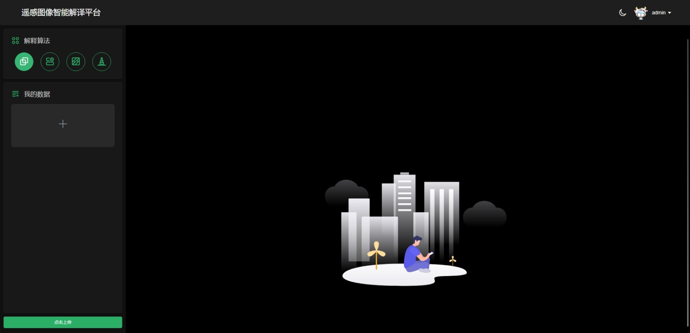
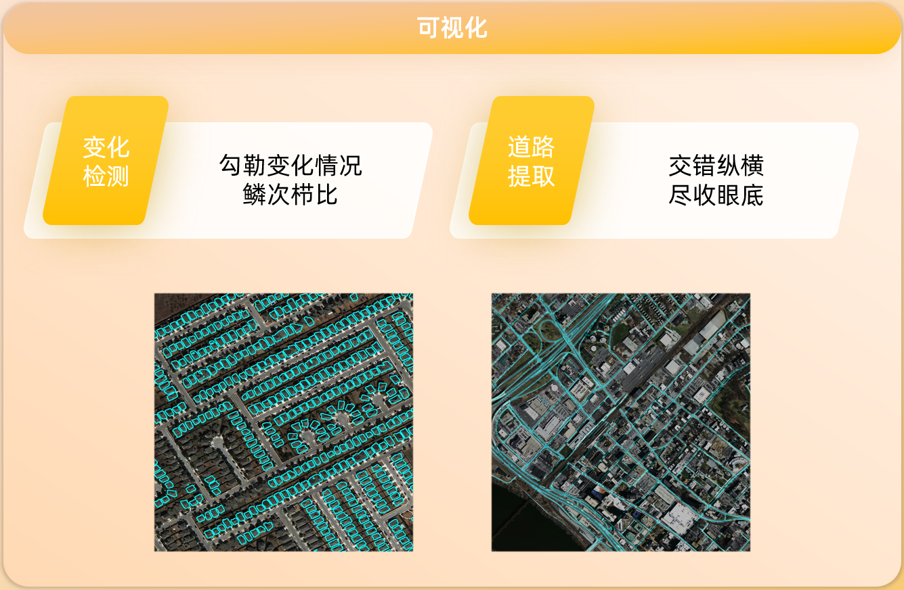
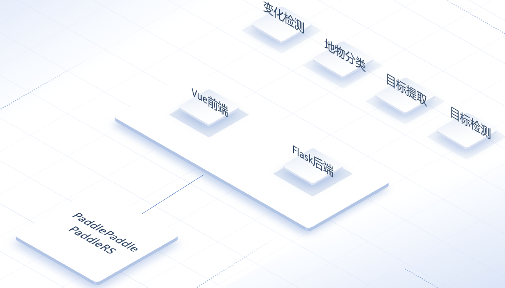

    
  

# 简介
本项目为 划水运动员队 项目文档
# 功能概述

- 目标提取（使用图像分割技术对卫星图像中指定对象完成分割）
- 变化检测（使用图像分割技术对同区域两个时期的卫星图像变化情况完成分析）
- 目标检测（使用目标检测技术对卫星图像中指定对象完成检测）
- 地物分类（使用图像分割技术对卫星图像每个像素完成分类）

支持`jpg` `png`等主流图片格式，支持大图推理
## 扩展功能

- 用户登录
- 区分账号等级
# 亮点一览
## 极简交互
用户界面友好，无需多级页面翻找，主页即可体验所有功能

    
  

## 可视化结果展示

    
  

同时还支持结果缩放，滑动鼠标滚轮即可体验~

# 使用方法
## 在线体验
访问demo页面，选择解译功能，上传图片即可快速查看结果。

## [部署教程](https://github.com/WAWXuan/potato/blob/main/docs/%E9%83%A8%E7%BD%B2%E6%95%99%E7%A8%8B.md)
## 系统架构

    
  

### 前端

- 开发框架：Vue
- 组件库：Element-UI
### 后端

- 主语言：Python
- 开发框架：Flask
### 算法

- 开发框架：PaddlePaddle
- 开发套件：PaddleRS
## 技术支持
<!--  -->

    
  

本项目使用百度AI Studio平台进行训练，基于国产化人工智能框架——百度飞桨PaddlePaddle框架进行开发，通过深度学习技术实现对遥感图像自动解译。项目依托PaddleRS套件搭建模型训练与推理框架。PaddleRS是基于飞桨开发的遥感处理平台，支持遥感图像分类、目标检测、图像分割、以及变化检测等常用遥感任务，能够帮助开发者更便捷地完成从训练到部署全流程遥感深度学习应用。

## [详细技术方案](https://github.com/WAWXuan/potato/blob/main/docs/%E6%8A%80%E6%9C%AF%E6%96%B9%E6%A1%88.md)
