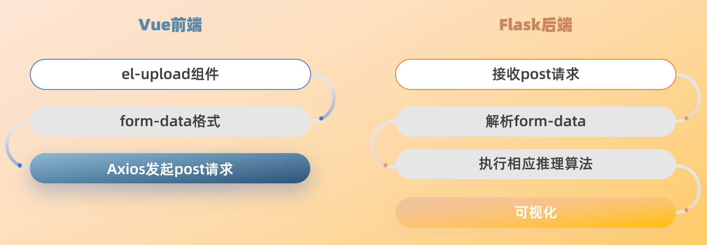

# 部署

    

## 前端
前端采用vue2 elementUI，预留横向菜单和左侧菜单的功能扩展，封装axio网络请求，修改el-upload控件，采用form-data模式支持一次提交多张图片给后端进行算法处理，分析结果在右侧主区域实现图片的放大缩小功能，方便查看。
## 后端
后端框架选用Flask，轻量级的可定制框架，使用Python语言编写。Flask 提供的是一个最小化的 Web 框架，对于初学者，可以利用社区中丰富的资源快速上手。
# 算法
## 模型选型
### 目标提取
模型：[DeepLabv3+](https://arxiv.org/abs/1802.02611)
DeepLabv3+的作者通过encoder-decoder进行多尺度信息的融合，同时保留了原来的空洞卷积和ASPP层， 其骨干网络使用了Xception模型，提高了语义分割的健壮性和运行速率，在 PASCAL VOC 2012 dataset取得新的state-of-art performance，89.0mIOU。

#### ASPP (Atrous Spatial Pyramid Pooling)
通过不同采样率的空洞卷积获取不同尺度的特征信息。具体可参见[DeepLabv2](https://arxiv.org/pdf/1606.00915.pdf) 

### 变化检测
模型：[BIT-CD](https://github.com/justchenhao/BIT_CD)[1]
BIT-CD的结构如下图所示。作者通过一个CNN骨干网络（ResNet）从输入图像对中提取高层语义特征，并且使用空间注意力将每个时间特征图转换成一组紧凑的语义tokens。然后使用一个transformer编码器在两个tokens集中建模上下文，得到了富有上下文的tokens被一个连体transformer解码器重新投影到像素级空间，以增强原始像素级特征。最终，作者从两个细化的特征图计算特征差异图像(FDIs)，然后将它们送到浅层CNN以产生像素级变化预测。

> [1] Hao Chen, Zipeng Qi, and Zhenwei Shi. **Remote Sensing Image Change Detection with Transformers.** _IEEE Transactions on Geoscience and Remote Sensing._

### 目标检测
模型：[PP-YOLO](https://arxiv.org/abs/2007.12099)
PP-YOLO是PaddleDetection优化和改进的YOLOv3的模型，其精度(COCO数据集mAP)和推理速度均优于YOLOv4模型，要求使用PaddlePaddle 2.0.2(可使用pip安装) 或适当的develop版本。
PP-YOLO在COCO test-dev2017数据集上精度达到45.9%，在单卡V100上FP32推理速度为72.9 FPS, V100上开启TensorRT下FP16推理速度为155.6 FPS。

PP-YOLO和PP-YOLOv2从如下方面优化和提升YOLOv3模型的精度和速度：

- 更优的骨干网络: ResNet50vd-DCN
- 更大的训练batch size: 8 GPUs，每GPU batch_size=24，对应调整学习率和迭代轮数
- Drop Block
- Exponential Moving Average
- IoU Loss
- Grid Sensitive
- Matrix NMS
- CoordConv
- Spatial Pyramid Pooling
- 更优的预训练模型
- PAN
- Iou aware Loss
- 更大的输入尺寸
> [https://github.com/PaddlePaddle/PaddleDetection/blob/release/2.4/configs/ppyolo/README_cn.md](https://github.com/PaddlePaddle/PaddleDetection/blob/release/2.4/configs/ppyolo/README_cn.md)

### 地物分类
模型：[DeepLabv3+](https://arxiv.org/abs/1802.02611)
> 同[目标提取](https://github.com/WAWXuan/potato/blob/main/docs/%E6%8A%80%E6%9C%AF%E6%96%B9%E6%A1%88.md#%E7%9B%AE%E6%A0%87%E6%8F%90%E5%8F%96)

## 训练策略
### 数据增强

- 随机裁剪
- 随机翻转
- 随机色彩变幻
- 随机模糊
- ······
# 推理

- 即使经过适当的预处理，实际的遥感影像仍常常具有较大的空间尺寸。针对大幅影像，将整图输入网络进行推理是比较耗费资源的。因此，本项目采用滑窗推理的方案，提升推理性能。